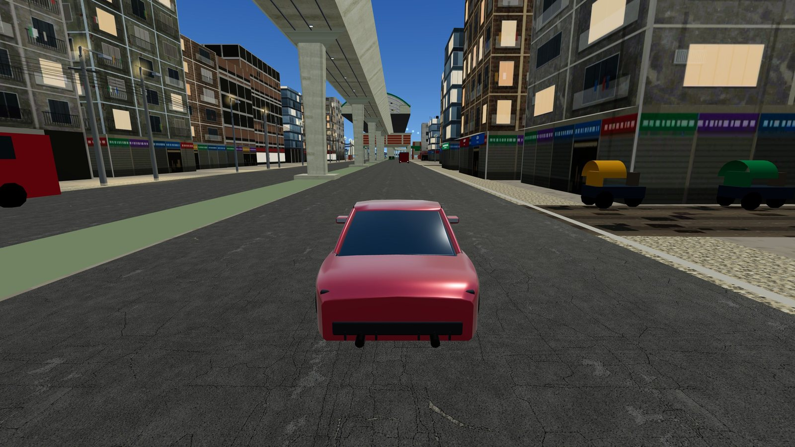
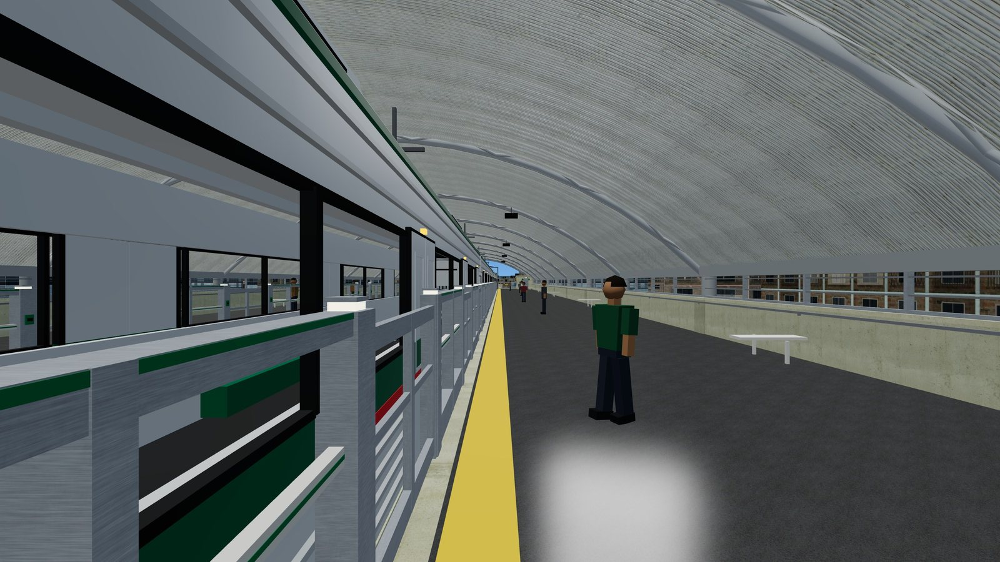
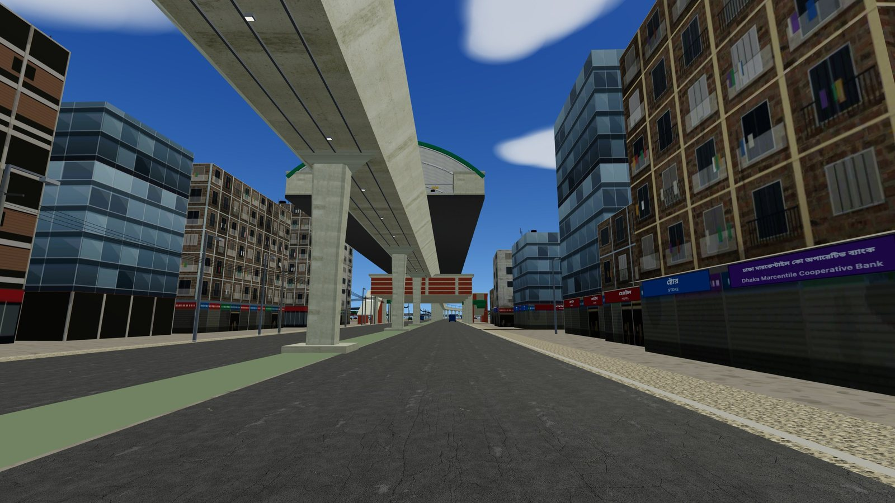
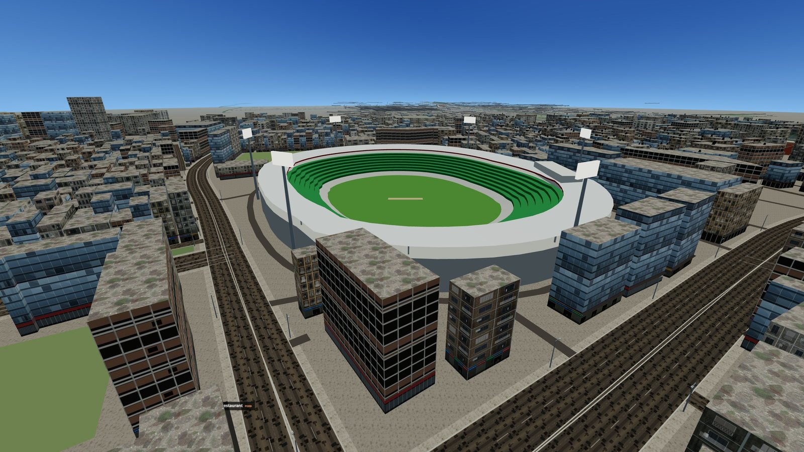
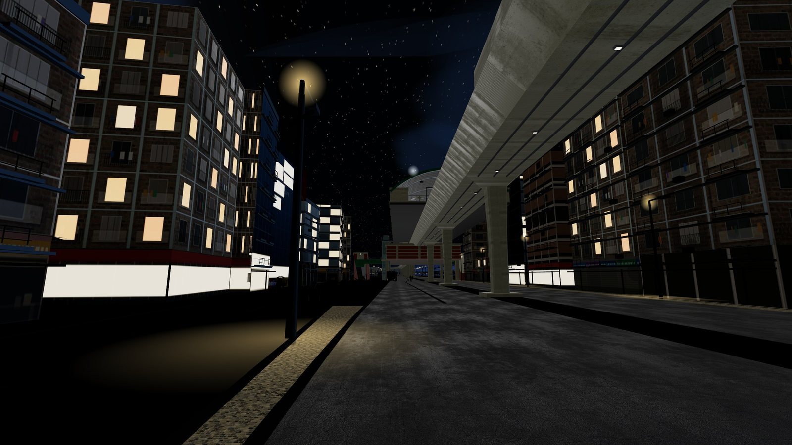

# Mirpur Drive

A walkable and drivable 3D reconstruction of the Mirpur corridor along
**MRT Line 6** in Dhaka, Bangladesh — Mirpur 10, Mirpur 11, Pallabi and
Uttara South, plus the west arm toward Mirpur 1/2 and the east arm toward
Kachukhet. Runs entirely in the browser: Three.js, Vite, no backend, no
build-time framework.

Street layout, building footprints and the metro alignment are real,
pulled from OpenStreetMap. The metro stations, the Pallabi/Mirpur 12
streetscape and its shopfronts are modelled against the owner's own
photographs and Google Street View of the real place, not invented.



**[Screenshots](#screenshots)** · **[Controls](#controls)** · **[Contributing](#contributing)**

## Features

- **Walk or drive** the real street grid — WASD on foot, or get in the car
  (`V`) with a synthesized engine note that responds to throttle and speed.
- **Real metro**: MRT Line 6 viaduct with tapered piers, precast girder
  segments, and walkable Mirpur 10/11 station interiors — street → stair →
  concourse → gate → platform, with working escalators and a lift.
- **A real neighbourhood, not a generic one**: the Pallabi/Mirpur 12
  stretch is built from the owner's own Street View reference — real
  building massing, real signage grammar (pharmacy green, bKash pink,
  telecom orange, weighted to the actual density of shops OpenStreetMap
  records there), and two hand-modelled landmark buildings reproducing a
  real street corner sign-for-sign.
- **Living street**: traffic and pedestrians that follow the player around
  a 4+ km map instead of thinning out, drive on the correct (left) side,
  queue instead of merging into each other, and never visibly pop in or
  out of existence.
- **On-foot street life**: hail a rickshaw, CNG or bus, stop at cha stalls,
  follow a food trail, and keep a journal (`J`) of your wallet, what you ate
  and the places you discovered.
- **Ride the metro**: buy in at the gates, board through the platform screen
  doors and ride MRT Line 6 between districts — north Mirpur and the
  Agargaon / Bijoy Sarani / Farmgate stretch with Jatiya Sangsad Bhaban.
- **Real landmarks**: Sher-e-Bangla National Cricket Stadium, the Mirpur 10
  foot over bridge and golchokkor, the Benarasi Palli gate and saree
  shopfronts — all one keypress away from the teleport menu (`O`).
- **Day/night cycle**, a drifting cloud layer, and a GTA-style rotating
  minimap plus a full pannable/zoomable map with GPS waypoints.
- **Touch controls** for phones and tablets.
- **Destructible streetlights** — clip one with the car at speed and it
  topples and stays down; it does not stop the car.

## Screenshots

<table>
<tr>
<td width="50%"><a href="screenshots/gallery/metro-platform.jpg"></a><br><sub>On the platform: train berthed at the platform screen doors</sub></td>
<td width="50%"><a href="screenshots/gallery/metro-viaduct.jpg"></a><br><sub>Mirpur 11 — viaduct, piers and station from the street</sub></td>
</tr>
<tr>
<td width="50%"><a href="screenshots/gallery/stadium.jpg"></a><br><sub>Sher-e-Bangla National Cricket Stadium</sub></td>
<td width="50%"><a href="screenshots/gallery/night.jpg"></a><br><sub>Night: lit windows, streetlights and stars</sub></td>
</tr>
</table>

More in **[SCREENSHOTS.md](SCREENSHOTS.md)** — streets, stations, landmarks, dusk and night.

## Quick start

```bash
npm install
npm run dev
```

Open the printed local URL, click **Enter the street**, and go. `W A S D`
to move, mouse to look, `V` to get in/out of the car, `O` to teleport
anywhere, `M` for the full map, `H` for the in-game key list.

### Build for production

```bash
npm run build
```

Outputs a fully static site to `dist/` — no server-side code, nothing to
configure. Deploys to Netlify (or any static host) with:

```
Build command:      npm run build
Publish directory:  dist
```

### Rebuilding the map data (optional)

The playable map ships pre-built in `public/scene.json` /
`public/scene-north.json`, so this is never required just to run the game.
The raw OpenStreetMap dumps `tools/build-scene.mjs` reads
(`data/*.osm.json`, ~70 MB combined) are **not committed** — they're
machine-fetched and fully regenerable. To rebuild them:

1. Run the queries in `data/query.overpassql` / `data/query-north.overpassql`
   against the [Overpass API](https://overpass-api.de/) and save the results
   as `data/mirpur.osm.json` / `data/north.osm.json`.
2. *(Optional)* `node tools/fetch-heights.mjs --in data/mirpur.osm.json --out
   data/heights-mirpur.json` to look up real, satellite-measured building
   heights from Google's
   [Open Buildings 2.5D Temporal](https://sites.research.google/gr/open-buildings/temporal/)
   dataset (© Google, [CC-BY-4.0](https://creativecommons.org/licenses/by/4.0/))
   instead of guessing them from footprint area. It streams only the raster
   tiles each extract's buildings actually touch (a few minutes cold, free on
   a re-run — tiles are cached under `.cache/`) and writes a side-table of
   `{ osm id: { p50, p75, p90, max, mean, n, area } }` — every percentile a
   footprint's in-bounds pixels support, not just one, so an estimator can be
   picked and re-tuned (`tools/calibrate-heights.mjs`, below) without
   re-fetching. Repeat with `--in data/north.osm.json --out
   data/heights-north.json` for the north extract.
3. *(Optional)* `node tools/calibrate-heights.mjs` to validate that side-table
   against OSM's own `building:levels` ground truth (~1800 buildings pooled
   across both extracts carry one) and print a 5-fold cross-validated
   comparison of candidate estimators. This is how `build-scene.mjs`'s raster
   branch — currently the raw, uncalibrated per-footprint max height — was
   chosen; see that function's comments for the full reasoning.
4. `npm run data` to turn them into `public/scene.json` / `public/scene-north.json`.
   Pass `--heights data/heights-mirpur.json` (or `-north`) to fold step 2's
   measured heights in ahead of the footprint-area heuristic; omit it to keep
   the pre-dataset, fully-inferred behaviour.

## Controls

| Key | Action |
|---|---|
| `W A S D` + mouse | Walk / look |
| `Shift` / `Space` | Run / jump |
| `E` | Interact: hail a ride, cha stalls, food, station gates and trains |
| `J` | Journal: wallet, food diary, places discovered |
| `V` | Enter / exit the car |
| `Space` / `X` / `C` / `K` (driving) | Handbrake and drift / switch car / cycle camera / horn |
| `O` | Teleport menu: every station and landmark |
| `1` / `2` / `5` / `6` | Jump to Pallabi / Mirpur 11 / Mirpur 10 / Uttara South |
| `M` (or click the minimap) | Full map; right-click or double-click sets a GPS waypoint |
| `T` | Cycle time of day |
| `N` | Mute / unmute sound |
| `H` | Toggle the help panel |
| `Esc` | Release the mouse / close the open menu |

## Project layout

| Path | Purpose |
|---|---|
| `src/main.js` | Boot sequence, HUD, key bindings, frame loop |
| `src/city.js` | Building extrusion, tile streaming, collision |
| `src/streets.js` | Roads, footpaths, streetlights, street furniture |
| `src/metro.js` | Viaduct, piers, stations, trains |
| `src/interior.js` / `src/walkable.js` | Walkable station interiors |
| `src/facades.js` / `src/signs.js` | Procedural building and shop-sign textures |
| `src/landmarks.js` | Hand-modelled real buildings on the Mirpur 12 stretch |
| `src/traffic.js` | Vehicles and pedestrians |
| `src/drive.js` | Drivable car: physics, model, sound, feel |
| `src/player.js` | First-person walk controller |
| `src/minimap.js` / `src/map/` | Corner minimap, full map, road graph and GPS navigation |
| `src/districts.js` | District definitions (north Mirpur, Bijoy Sarani), quick travel and teleport destinations |
| `src/streetlife/` | On-foot gameplay: rides, cha stalls, food trail, journal |
| `src/stationlife.js` / `src/traininterior.js` | Station crowds, boarding, and the rideable train interior |
| `src/stadium.js` / `src/sangsad.js` / `src/benarasi-palli.js` / `src/mirpur10-bridge.js` | Hand-modelled landmarks |
| `src/mobile-controls.js` | Touch controls |
| `src/audio.js` / `src/worldaudio.js` | Shared WebAudio context, street ambience |
| `src/destructibles.js` | Knockable streetlight poles |
| `src/sky.js` / `src/night.js` | Sky, sun, clouds, day/night lighting |
| `tools/build-scene.mjs` | OpenStreetMap → `public/scene*.json` |
| `tools/fetch-heights.mjs` | Open Buildings 2.5D Temporal → `data/heights-*.json` (optional) |
| `tools/calibrate-heights.mjs` | Validates raster height estimators against OSM `building:levels` ground truth (optional) |
| `docs/` | Development history, decisions and verification logs |
| `reference/` | Modelling reference (CC-licensed photos with credits, written observations) — not shipped |

## Contributing

Contributions are very welcome — especially from people who know Mirpur.
[CONTRIBUTING.md](CONTRIBUTING.md) is the starting point, with separate
guides for [map data](docs/contributing/MAP.md),
[textures](docs/contributing/TEXTURES.md),
[3D models](docs/contributing/MODELS.md),
[landmarks, signage and reference photos](docs/contributing/LANDMARKS.md) and
[code](docs/contributing/CODE.md).

## Data & licensing

- **Code**: [MIT](LICENSE) © Abir Kolin. The bundled data and assets below
  keep their own licences.
- **Map data**: © [OpenStreetMap](https://www.openstreetmap.org/copyright)
  contributors, [ODbL](https://opendatacommons.org/licenses/odbl/).
- **Building heights**: mostly © Google Research,
  [Open Buildings 2.5D Temporal](https://sites.research.google/gr/open-buildings/temporal/),
  [CC-BY-4.0](https://creativecommons.org/licenses/by/4.0/); buildings the
  dataset doesn't cover fall back to an estimate from footprint area.
- **Textures**: CC0 1.0, from [ambientCG](https://ambientcg.com) — see
  `public/textures/LICENSES.md`.
- **Vehicle models**: CC0 1.0, from [Kenney](https://kenney.nl) — see
  `public/models/LICENSES.md`.
- **Audio**: entirely synthesized at runtime (WebAudio oscillators and
  filtered noise) — no sampled audio files ship. See `public/audio/LICENSES.md`.
- **Reference imagery** in `reference/` is Wikimedia Commons photos under
  CC BY / CC BY-SA / CC0, credited per folder in `CREDITS.md`. Mapillary
  street-level imagery, Google Street View and news photography were only
  ever *viewed* and written up as observations — none of it is committed.
  Reference informed geometry, colour and signage layout but is never
  shipped and never used as a texture — see `reference/README.md`. Real
  business names on the Pallabi stretch (§ `src/landmarks.js`) are
  reproduced as plain text signage for a non-commercial personal
  simulation of a real streetscape; proprietary logo artwork is not
  redrawn.

## Status

Actively in development. `docs/` is the project's working log, newest
passes dated in the filename (e.g. `docs/ONFOOT-PASS-2026-09-20.md`);
`docs/HANDOFF.md` and `docs/PAUSE-STATE.md` describe the early arrangement
and are kept as history, not as the current state.
