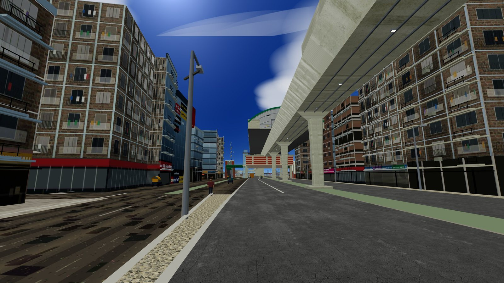
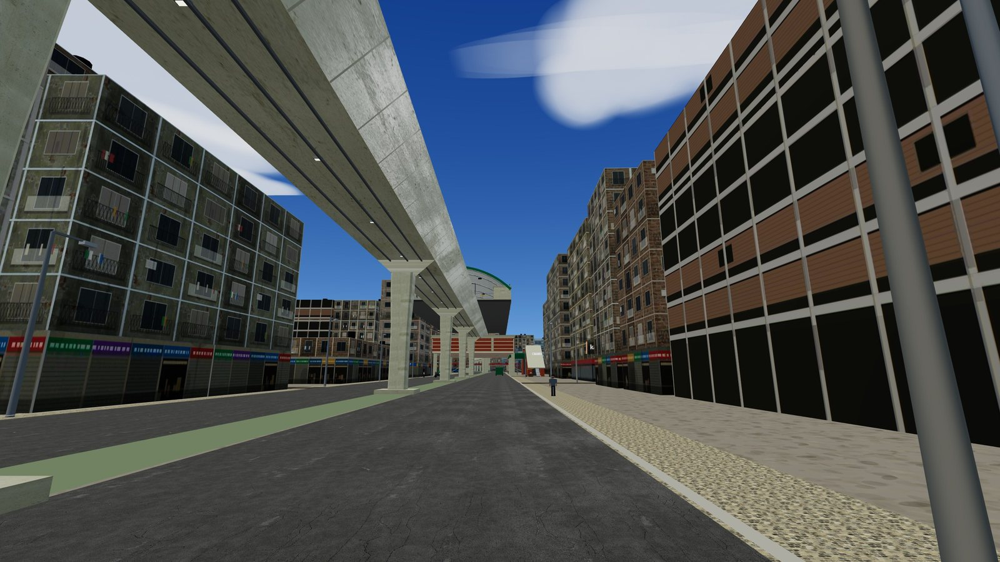
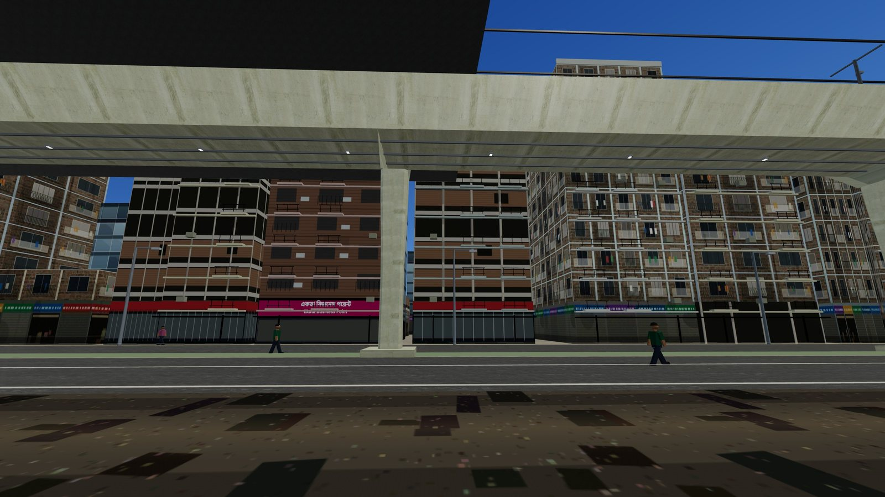
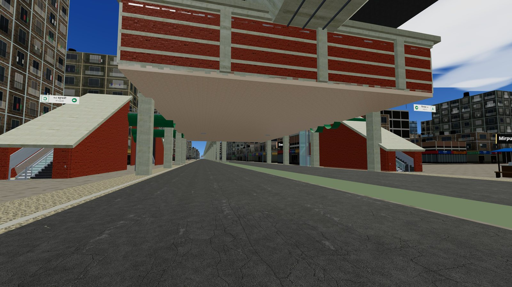
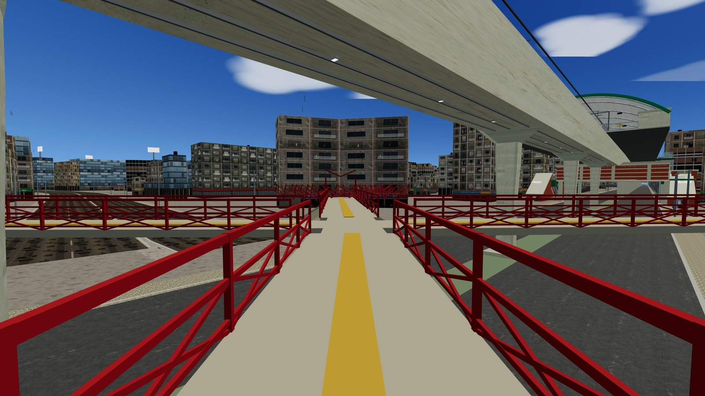
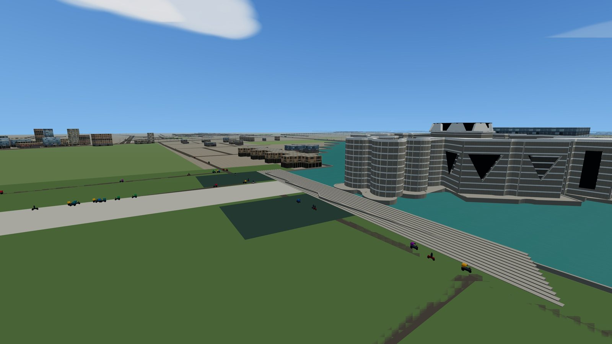
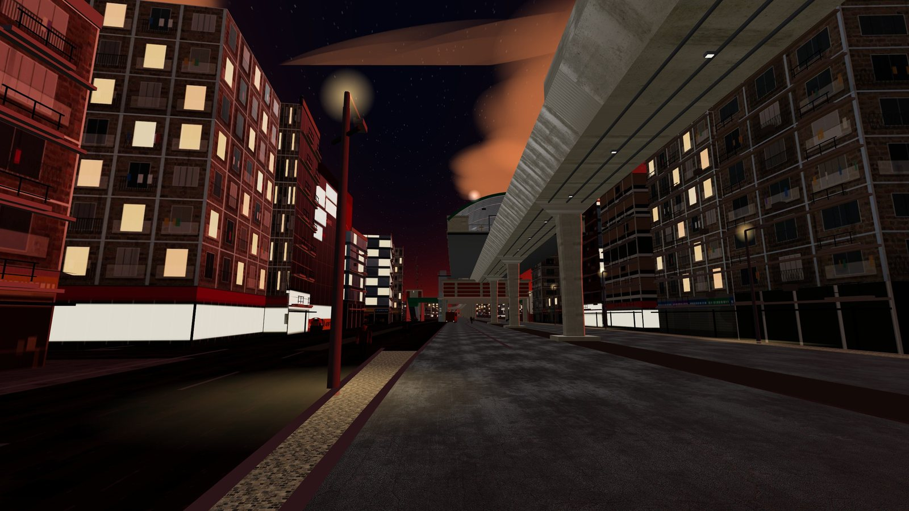

# Screenshots

All captured in-game, in the browser, at the default quality settings.
Click any image for the full 1600×900 frame.

## On the road

<table>
<tr>
<td width="50%"> Driving the corridor under the MRT Line 6 viaduct, with buses and CNGs</td>
<td width="50%"> Pallabi, looking down the corridor</td>
</tr>
<tr>
<td width="50%"> Approaching Mirpur 10 station</td>
<td width="50%"> Pallabi shopfronts and signage under the viaduct</td>
</tr>
</table>

## The metro

<table>
<tr>
<td width="50%"> On the platform: train berthed at the platform screen doors</td>
<td width="50%"> Mirpur 11 — viaduct, piers and station from the street</td>
</tr>
<tr>
<td width="50%"> Mirpur 10 golchokkor: station entrances under the concourse</td>
<td width="50%"> The Mirpur 10 foot over bridge</td>
</tr>
</table>

## Landmarks

<table>
<tr>
<td width="50%"> Sher-e-Bangla National Cricket Stadium</td>
<td width="50%"> Jatiya Sangsad Bhaban across the lake (Bijoy Sarani district)</td>
</tr>
</table>

## Dusk and night

<table>
<tr>
<td width="50%"> Dusk</td>
<td width="50%"> Night: lit windows, streetlights and stars</td>
</tr>
</table>

---

Want yours here? Shots of a newly modelled landmark are welcome in the same PR —
see [CONTRIBUTING.md](CONTRIBUTING.md). 1600×900 JPEG, no HUD, under ~300 KB, in `screenshots/gallery/`.
